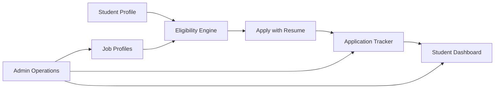

<div align="center">

# IIIT Lucknow Placement Portal

### One portal for opportunities, applications, student profiles, and placement operations

[](https://nextjs.org/)
[](https://www.typescriptlang.org/)
[](https://www.postgresql.org/)
[](https://www.prisma.io/)
[](https://www.docker.com/)

A responsive student and administration platform for the Training & Placement Cell at IIIT Lucknow.

</div>

---

## What it does

The portal gives students a single place to discover opportunities, verify eligibility, manage their placement profile and resumes, apply to roles, track application progress, submit feedback, and request NOCs.

Placement administrators receive a separate role-protected workspace for companies, events, applications, students, announcements, feedback, NOCs, team members, administrators, and placement analytics.


```mermaid
flowchart LR
    P[Student Profile] --> E[Eligibility Engine]
    J[Job Profiles] --> E
    E --> A[Apply with Resume]
    A --> T[Application Tracker]
    T --> D[Student Dashboard]
    AD[Admin Operations] --> J
    AD --> T
    AD --> D
```

## Highlights

### Student portal

- Searchable announcement dashboard with deadlines and placement metrics
- Company opportunity directory with type and status filters
- Automatic CGPA, batch, branch, backlog, ban, and document eligibility checks
- Application timeline from applied through selection
- Editable personal, academic, contact, identity-document, and resume sections
- Feedback/query tracking, placement guidelines, NOC requests, forms, contacts, and team directory

### Administration portal

- Placement analytics and branch-level reporting UI
- Management surfaces for announcements, companies, events, and applications
- Student, feedback, NOC, placement-team, and administrator management
- Server-side role protection for all `/admin/*` routes

### Engineering foundation

- Google OAuth through Auth.js with `@iiitl.ac.in` domain enforcement
- PostgreSQL schema and migrations managed through Prisma
- AES-256-GCM helpers for sensitive identity fields
- Shared eligibility engine with unit tests
- Dockerized application and PostgreSQL services
- GitHub Actions verification pipeline
- Cross-agent project context for consistent team contributions

## Technology

| Layer | Stack |
|---|---|
| Frontend (`frontend/`) | Next.js 16 App Router, React 19, TypeScript 5 |
| Backend API (`backend/`) | FastAPI, SQLAlchemy 2, Pydantic 2, Python 3.12 |
| Database (`database/`) | PostgreSQL 16, Prisma 6 schema and migrations |
| Cache | Redis 7, in front of the announcement and event reads; optional at runtime |
| Styling | Tailwind CSS 4, responsive repository-owned design system |
| Authentication | Auth.js, Google OAuth, JWT sessions shared with the backend |
| Validation and security | Zod, Pydantic, AES-256-GCM, security headers |
| Testing | Node test runner with `tsx`, pytest |
| Infrastructure | Docker, Docker Compose, GitHub Actions |

Each service has its own container. `frontend` and `database` are npm workspaces
sharing one lockfile at the repository root; `backend` is an independent Python
service. The Prisma schema in `database/` is the single owner of the database
structure, and the backend's SQLAlchemy models mirror it without migrating it.

## Quick start

Docker Desktop is the only requirement. Everything else — Node, Python, the
Prisma CLI, `psql` — runs inside containers.

```bash
make up                              # build, start, and wait for the stack
make admin EMAIL=you@iiitl.ac.in     # grant yourself administrator access
make seed                            # fill the database with the complete dataset
make password EMAIL=you@iiitl.ac.in  # set your password, then sign in
```

`make up` writes a `.env` from `.env.example` on first run, generating
`AUTH_SECRET`, `ENCRYPTION_KEY`, and `DB_ADMIN_PASSWORD` for you. Compose
refuses to start without the first two, and there is no built-in
administrator: `ADMIN_EMAILS` is the only source of one, which is why
`make admin` comes before `make seed`. Never commit `.env` or real student
data.

An `.env` written before `DB_ADMIN_PASSWORD` existed has no line for it, which
leaves the table browser below switched off. `make db-admin-password` adds one.

The stack also runs a Redis container, which caches the announcement and
company-event reads that every signed-in page makes. It needs no
configuration: Compose points the backend at it, and `CACHE_TTL_SECONDS`
(default 300) is the only knob. It is optional at runtime in the strict
sense — stop the container, or clear `REDIS_URL`, and those endpoints query
PostgreSQL on every request and return the same answers, only slower. Nothing
is stored there that one query cannot rebuild, so it has no volume and a
restart is a cold cache rather than data loss. `make cache-stats` shows what
it holds; `make cache-clear` drops it.

Open [http://localhost:3000](http://localhost:3000). The API docs are at
[http://localhost:8000/docs](http://localhost:8000/docs).

Four containers make up the stack: `db` (PostgreSQL 16), `migrate` (applies
Prisma migrations and seeds administrators, then exits), `backend` (FastAPI on
port 8000), and `frontend` (Next.js on port 3000). A fifth, `tools`, is never
started by `up`; it is the one-shot container behind every `make db-*` command.

### Everyday commands

`make` on its own prints the full list. The ones worth knowing:

| Command | What it does |
| --- | --- |
| `make up` | Build, start, and wait for the whole stack |
| `make dev` | The same stack with hot reload on both apps |
| `make seed` | Migrations, administrators, the student roster, and demonstration data |
| `make down` / `make logs` / `make ps` | Stop, follow logs, list what is running |
| `make db-admin` | Where to find the table browser on the backend |
| `make db-psql` / `make db-studio` | A psql shell, or Prisma Studio on port 5555 |
| `make db-reset` | Drop the volume and rebuild the database from scratch |
| `make db-dump` / `make db-restore FILE=…` | Back up and restore |
| `make cache-stats` / `make cache-clear` | Inspect or drop the announcement and event cache |
| `make check` | Lint, type-check, unit tests, and the production build |

### Reading and editing the tables directly

Three ways in, from most to least guarded:

1. **The admin portal**, `http://localhost:3000/admin`. The product surface,
   bound by role permissions. Use it for anything it has a screen for.
2. **The table browser**, `http://localhost:8000/admin`. Every row of all 15
   tables, listed, searchable, sortable, and editable, grouped in a sidebar.
   It consults no role, so `make env` guards it with a generated
   `DB_ADMIN_PASSWORD` and the backend refuses to mount it without one.
   `make db-admin` prints the URL; the password is in `.env`.
3. **`make db-psql`** for a SQL prompt, or **`make db-studio`** for Prisma
   Studio on port 5555.

The table browser reaches `passwordHash` and the encrypted Aadhaar and PAN
columns, because a tool that cannot see a column cannot fix it. It holds no
encryption key, so identity fields read as ciphertext. Keep port 8000 off the
public internet, and rotate the password with `make db-admin-password`.

### Running the services outside Docker

Useful when you want a debugger attached to one service.

```bash
docker compose up -d db      # database only
npm install                  # installs both npm workspaces
npm run db:migrate
npm run db:seed
npm run dev                  # frontend on :3000

# in a second terminal
cd backend
pip install -r requirements.txt
uvicorn main:app --reload    # backend on :8000
```

## Demonstration data

A sample dataset ships as `database/seed-data.zip` so the portal can be reviewed
with realistic content instead of empty tables. `make seed` loads it along with
the student roster; to load only this part:

```bash
make db-seed-demo
```

That adds 6 companies, 12 students, 8 events across active, ended, and
draft states, 29 applications, 11 announcements, 15 offers, 7 NOC requests,
feedback, and placement team members. The roster in `students_data.json` is a
separate step, `make db-seed-students`, and accounts for the other 445 students.
Run `make db-remove-demo` to take the demonstration rows out again.

### Populating your own account

The generated students have no Google account behind them, so they fill the admin
views but cannot sign in. Browse the student portal as yourself and Applications,
NOC requests, and My feedbacks are all empty, because that activity belongs to
students who do not exist as logins.

Pass your own address to attach a slice of the activity to your account:

```bash
make db-seed-demo EMAIL=you@iiitl.ac.in
```

You get 5 applications spanning applied, shortlisted, interview, and rejected, 2
NOC requests, and 2 feedback entries. Academic fields are filled in **only where
your profile has none**, so nothing you entered yourself is overwritten. The
address must already have signed in once; the script says so rather than creating
the account.

`make db-remove-demo` deletes this activity too but keeps your account. The
profile fields it filled are left in place, since there is no way to tell them
apart from values you later edited; clear them from the profile page if you want.

One more prerequisite: the seed needs an administrator to exist, because job
profiles and announcements record an author and `ADMIN_EMAILS` is the only
legitimate source of one. Run `make admin EMAIL=you@iiitl.ac.in` first on a
brand-new database.

Every row is written with a deterministic `demo-` prefixed id, which is what
makes the seed safe to re-run and lets the removal script delete exactly what it
created without touching real records. Dates are stored in the dataset as offsets
rather than fixed timestamps, so registration deadlines stay in the future however
long the archive sits in the repository.

To change the data, edit the JSON in `database/seed-data/` and repack it:

```bash
make db-pack-demo
```

This is one of the few commands that runs on the host rather than in a
container, because it writes a tracked file back into the repository.

## Authentication and access control

Sign-in is an email address and a password. There is no Google sign-in and no
OAuth client to configure.

- **Students** register themselves at `/register` with an address on the domain
  in `STUDENT_EMAIL_DOMAIN` (`iiitl.ac.in` by default). Any other address is
  refused with an explanation. Registering with an address that already has a
  passwordless student account claims that account, so profiles and
  applications from before survive.
- **Administrators** are defined solely by `ADMIN_EMAILS`. There is no built-in
  administrator account, and an address listed there may sign in from outside
  the institute domain. Those accounts are seeded without a password.
- **The first administrator** gets a password from the server shell:

  ```bash
  make password EMAIL=head.tpo@iiitl.ac.in
  ```

  The password is typed at a prompt, not passed as an argument, so it stays out
  of shell history.
- **Everyone else is provisioned from `/admin/users`**, which has a set-password
  control on each row. That is also the recovery path for a student who has lost
  their password, because there is no reset email.
- **`/account/password`** is where a signed-in user changes their own password,
  confirming the current one. It is in the account menu of both shells.

Registration does not send a verification email, so whoever registers an unused
institute address owns it. This is a deliberate, recorded trade-off; read the
2026-09-17 entries in `docs/DECISIONS.md` before exposing the portal beyond the
campus network.

```env
STUDENT_EMAIL_DOMAIN="iiitl.ac.in"
ADMIN_EMAILS="first.admin@example.com,second.admin@example.com"
```

The role is recomputed from `ADMIN_EMAILS` on every request rather than being
frozen into the session, so adding or removing an address takes effect as soon
as the services pick up the new value — no waiting for a session to expire. The
FastAPI service re-checks the allowlist too, so a token minted while an address
was still listed stops granting admin access once it is removed.

Run `make db-sync-admins` to reconcile roles already stored in the database: it
promotes every listed address and demotes any stored administrator that is no
longer listed.

Create a Google OAuth web client and register this callback:

```text
http://localhost:3000/api/auth/callback/google
```

Add the equivalent HTTPS callback before production deployment.

## Adding a company

1. Sign in with an administrator account and open `/admin/companies`.
2. Select **Add company**.
3. Enter the official company name. Website, logo URL, and description are optional but recommended.
4. Select **Create company**. The record is written to PostgreSQL and becomes available for event creation.
5. Use **Edit** to correct the recruiter profile. Deletion is blocked while events reference the company.

The company record is the parent recruiter entity. A separate event must be created for every internship or full-time role before students can see it under Company Events.

## Publishing a company event

1. Sign in with an administrator account and open **Events → Add event** (`/admin/events/add`).
2. Choose the placement year — the season the drive runs in — and the company.
3. Enter the job title, description, category, and employment type, then the batch it recruits and the last date to apply. The deadline is picked as a day plus a quarter-hour time.
4. Pick the allowed degrees, then the branches, which are offered grouped under the degrees you picked. Both lists come from the student roster. Turn on **Enable optional eligibility criteria** to restrict by gender or placement bans.
5. Leave the visibility on **Draft** while checking the details. Drafts are hidden from students.
6. Set it to **Active** with a future deadline to show the opportunity under Company Events and allow eligible students to apply. Publishing needs the `jobs.publish` permission.
7. Set it to **Ended** when applications should close. An event with applications cannot be deleted, preserving student records.

**Events → All events** (`/admin/events`) lists every drive with status, placement-year, batch, and type filters; its edit action opens the same form.

Student profiles appear under `/admin/students` after their first institute Google sign-in. Students maintain their own saved details from `/profile`; administrators receive a read-only view and sensitive identity numbers are never displayed.

## Commands

`make help` lists every command, each of which runs in Docker:

| Command | Purpose |
|---|---|
| `make up` / `make dev` | Run the stack, with or without hot reload |
| `make down` / `make stop` / `make restart` | Control a running stack |
| `make ps` / `make health` / `make logs` | See what is running and why it is not |
| `make clear-cache` | Drop the frontend build cache when a fixed compile error keeps being served |
| `make urls` | Print the published URLs, read from Compose |
| `make seed` | Migrations, administrators, the roster, and demonstration data |
| `make db-migrate` | Apply pending migrations |
| `make db-migrate-new NAME=add_field` | Create a migration from schema changes |
| `make db-seed-students` | Import the roster from `students_data.json` |
| `make db-seed-demo [EMAIL=…]` | Load the demonstration dataset, optionally onto your account |
| `make db-remove-demo` | Delete everything the demonstration seed created |
| `make db-pack-demo` | Rebuild `seed-data.zip` after editing `database/seed-data/` (host) |
| `make db-reset` | Drop the volume and rebuild the database from scratch |
| `make db-psql` / `make db-studio` | A psql shell, or Prisma Studio on port 5555 |
| `make db-admin` | Where to find the table browser, and whether it is on |
| `make db-admin-password` | Generate a new password for the table browser |
| `make db-dump` / `make db-restore FILE=…` | Back up and restore |
| `make cache-stats` | What the announcement and event cache is holding, and its hit rate |
| `make cache-clear` | Drop it; the next read of each rebuilds from Postgres |
| `make admin EMAIL=…` / `make password EMAIL=…` | Grant administrator access, set a password |
| `make db-sync-admins` | Promote listed admins and demote unlisted ones |
| `make check` | Lint, type-check, test, and build |
| `make test-backend` | Run pytest in the backend container |
| `make sh-frontend` / `make sh-backend` / `make sh-db` | Shell into a container |
| `make clean` / `make nuke` | Remove volumes, and optionally the images too |

The npm scripts underneath are still there for working outside Docker. Run them
from the repository root; they delegate to the right workspace.

| Command | Purpose |
|---|---|
| `npm run dev` | Start the frontend development server |
| `npm run build` | Create a production frontend build |
| `npm run lint` | Run ESLint |
| `npm run type-check` | Run strict TypeScript checks |
| `npm test` | Run auth, validation, eligibility, profile, and encryption tests |
| `npm run db:generate` | Generate Prisma Client |
| `npm run db:migrate` | Create/apply a development migration |
| `npm run db:deploy` | Apply existing migrations (used by the `migrate` container) |
| `npm run db:seed` | Create the administrator accounts listed in `ADMIN_EMAILS` |
| `npm run db:seed:demo` | Load the demonstration dataset from `database/seed-data.zip` |
| `npm run db:seed:demo -- you@iiitl.ac.in` | Same, and attach activity to your signed-in account |
| `npm run db:remove-demo` | Delete everything the demonstration seed created |
| `npm run db:pack:demo` | Rebuild `seed-data.zip` after editing `database/seed-data/` |
| `npm run db:sync-admins` | Promote listed admins and demote unlisted ones |
| `npm run db:studio` | Open Prisma Studio |

Backend commands run from `backend/`:

| Command | Purpose |
|---|---|
| `uvicorn main:app --reload` | Start the API with hot reload |
| `pytest` | Run backend tests |

Run the full verification suite before opening a pull request:

```bash
make check         # lint, type-check, unit tests, production build
make test-backend  # pytest, in the backend container
```

## Repository structure

```text
frontend/                   Next.js application (npm workspace)
  src/app/                  App Router pages and route handlers
  src/components/           Student and admin UI, grouped by feature
  src/lib/                  Auth, backend client, encryption, eligibility
  Dockerfile                Production image
  Dockerfile.dev            Hot-reload image
backend/                    FastAPI service
  app/core/                 Config, database session, security, storage
  app/routers/              HTTP endpoints
  app/schemas/              Pydantic request/response models
  app/services/             Business rules such as eligibility
  tests/                    pytest suite
database/                   Prisma schema, migrations, seed (npm workspace)
  prisma/                   schema.prisma, migrations, seed.ts
  scripts/                  Administrative maintenance scripts
  Dockerfile                One-shot migration/seed runner
docker-compose.yml          Production-style stack
docker-compose.dev.yml      Hot-reload override
docs/                       Architecture, feature status, decisions, handoffs
```

## Current status

The database schema, authentication boundary, route protection, migration, seed data, encryption and eligibility utilities, Docker setup, CI, student-owned core records, admin companies, admin students, and job publishing are implemented.

The remaining incomplete modules show explicit empty or implementation states instead of demonstration records. The exact boundary for every module is maintained in [Feature Status](./docs/FEATURE_STATUS.md).

## Contributing with humans or coding agents

All contributors and coding agents start with:

1. [Agent Operating Guide](./AGENTS.md)
2. [Canonical Project Context](./docs/PROJECT_CONTEXT.md)
3. [Feature Status](./docs/FEATURE_STATUS.md)
4. [Current Handoff](./docs/HANDOFF.md)

Architectural decisions are recorded in [Decisions](./docs/DECISIONS.md), and the contribution workflow is documented in [CONTRIBUTING.md](./CONTRIBUTING.md). Claude, Cursor, and GitHub Copilot also receive tool-specific entry files that point back to the same canonical context.

## Security notes

- Keep OAuth, database, email, storage, and encryption credentials outside source control.
- Authorize every sensitive operation on the server.
- Encrypt Aadhaar/PAN values before persistence and never include them in logs.
- Validate uploaded resumes by ownership, MIME type, signature, and size.
- Replace all local/demo secrets before deployment.

---

<div align="center">
Built for the Training & Placement community at IIIT Lucknow.
</div>
