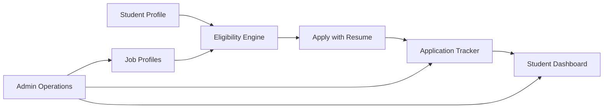

<div align="center">

# IIIT Lucknow Placement Portal

### One portal for opportunities, applications, student profiles, and placement operations

[](https://nextjs.org/)
[](https://www.typescriptlang.org/)
[](https://www.postgresql.org/)
[](https://www.prisma.io/)
[](https://www.docker.com/)

A responsive student and administration platform for the Training & Placement Cell at IIIT Lucknow.

</div>

---

## What it does

The portal gives students a single place to discover opportunities, verify eligibility, manage their placement profile and resumes, apply to roles, track application progress, submit feedback, and request NOCs.

Placement administrators receive a separate role-protected workspace for companies, job profiles, applications, students, announcements, feedback, NOCs, team members, administrators, and placement analytics.


```mermaid
flowchart LR
    P[Student Profile] --> E[Eligibility Engine]
    J[Job Profiles] --> E
    E --> A[Apply with Resume]
    A --> T[Application Tracker]
    T --> D[Student Dashboard]
    AD[Admin Operations] --> J
    AD --> T
    AD --> D
```

## Highlights

### Student portal

- Searchable announcement dashboard with deadlines and placement metrics
- Company opportunity directory with type and status filters
- Automatic CGPA, batch, branch, backlog, ban, and document eligibility checks
- Application timeline from applied through selection
- Editable personal, academic, contact, identity-document, and resume sections
- Feedback/query tracking, placement guidelines, NOC requests, forms, contacts, and team directory

### Administration portal

- Placement analytics and branch-level reporting UI
- Management surfaces for announcements, companies, job profiles, and applications
- Student, feedback, NOC, placement-team, and administrator management
- Server-side role protection for all `/admin/*` routes

### Engineering foundation

- Google OAuth through Auth.js with `@iiitl.ac.in` domain enforcement
- PostgreSQL schema and migrations managed through Prisma
- AES-256-GCM helpers for sensitive identity fields
- Shared eligibility engine with unit tests
- Dockerized application and PostgreSQL services
- GitHub Actions verification pipeline
- Cross-agent project context for consistent team contributions

## Technology

| Layer | Stack |
|---|---|
| Frontend (`frontend/`) | Next.js 16 App Router, React 19, TypeScript 5 |
| Backend API (`backend/`) | FastAPI, SQLAlchemy 2, Pydantic 2, Python 3.12 |
| Database (`database/`) | PostgreSQL 16, Prisma 6 schema and migrations |
| Styling | Tailwind CSS 4, responsive repository-owned design system |
| Authentication | Auth.js, Google OAuth, JWT sessions shared with the backend |
| Validation and security | Zod, Pydantic, AES-256-GCM, security headers |
| Testing | Node test runner with `tsx`, pytest |
| Infrastructure | Docker, Docker Compose, GitHub Actions |

Each service has its own container. `frontend` and `database` are npm workspaces
sharing one lockfile at the repository root; `backend` is an independent Python
service. The Prisma schema in `database/` is the single owner of the database
structure, and the backend's SQLAlchemy models mirror it without migrating it.

## Quick start

### Requirements

- Docker Desktop with the Linux engine running
- Node.js 20 or newer and npm (only for running the frontend outside Docker)
- Python 3.12 (only for running the backend outside Docker)

### 1. Configure the environment

Copy `.env.example` to `.env` and generate private values. One `.env` at the
repository root serves every service.

```powershell
Copy-Item .env.example .env
node -e "console.log(require('crypto').randomBytes(32).toString('base64url'))"  # AUTH_SECRET
node -e "console.log(require('crypto').randomBytes(32).toString('hex'))"        # ENCRYPTION_KEY
```

Set `AUTH_GOOGLE_ID`, `AUTH_GOOGLE_SECRET`, and at least one address in
`ADMIN_EMAILS`. Compose refuses to start if `AUTH_SECRET`, `ENCRYPTION_KEY`, or
the Google credentials are missing. Never commit `.env` or real student data.

### 2. Run everything with Docker

```bash
docker compose up --build
```

That starts four containers: `db` (PostgreSQL 16), `migrate` (applies Prisma
migrations and seeds administrators, then exits), `backend` (FastAPI on
port 8000), and `frontend` (Next.js on port 3000).

Open [http://localhost:3000](http://localhost:3000). The API docs are at
[http://localhost:8000/docs](http://localhost:8000/docs).

For hot reload while developing, add the dev override:

```bash
docker compose -f docker-compose.yml -f docker-compose.dev.yml up --build
```

### 3. Or run the services directly

```bash
docker compose up -d db      # database only
npm install                  # installs both npm workspaces
npm run db:migrate
npm run db:seed
npm run dev                  # frontend on :3000

# in a second terminal
cd backend
pip install -r requirements.txt
uvicorn main:app --reload    # backend on :8000
```

## Authentication and access control

Sign-in is Google-only; there are no password accounts. A user record is created
automatically on first successful sign-in.

- **Students** must use a Google account on the domain in `STUDENT_EMAIL_DOMAIN`
  (`iiitl.ac.in` by default). Any other account is refused with an explanation
  on the sign-in page.
- **Administrators** are defined solely by `ADMIN_EMAILS`. There is no built-in
  administrator account, and an address listed there may sign in from outside
  the institute domain.

```env
STUDENT_EMAIL_DOMAIN="iiitl.ac.in"
ADMIN_EMAILS="first.admin@example.com,second.admin@example.com"
```

The role is recomputed from `ADMIN_EMAILS` on every request rather than being
frozen into the session, so adding or removing an address takes effect as soon
as the services pick up the new value — no waiting for a session to expire. The
FastAPI service re-checks the allowlist too, so a token minted while an address
was still listed stops granting admin access once it is removed.

Run `npm run db:sync-admins` to reconcile roles already stored in the database:
it promotes every listed address and demotes any stored administrator that is no
longer listed.

Create a Google OAuth web client and register this callback:

```text
http://localhost:3000/api/auth/callback/google
```

Add the equivalent HTTPS callback before production deployment.

## Adding a company

1. Sign in with an administrator account and open `/admin/companies`.
2. Select **Add company**.
3. Enter the official company name. Website, logo URL, and description are optional but recommended.
4. Select **Create company**. The record is written to PostgreSQL and becomes available for job-profile creation.
5. Use **Edit** to correct the recruiter profile. Deletion is blocked while job profiles reference the company.

The company record is the parent recruiter entity. A separate job profile must be created for every internship or full-time role before students can see it under Company Events.

## Publishing a job profile

1. Sign in with a real Google administrator account and open `/admin/job-profiles`.
2. Select **Add job profile** and choose an existing company.
3. Enter the role, location, batch, deadline, compensation, and eligibility values. Branches and degrees are comma-separated.
4. Save as **Draft** while checking the details. Drafts are hidden from students.
5. Change the status to **Active** with a future deadline to show the opportunity under Company Events and allow eligible students to apply.
6. Change the status to **Ended** when applications should close. A job with applications cannot be deleted, preserving student records.

Student profiles appear under `/admin/students` after their first institute Google sign-in. Students maintain their own saved details from `/profile`; administrators receive a read-only view and sensitive identity numbers are never displayed.

## Commands

Run these from the repository root; they delegate to the right workspace.

| Command | Purpose |
|---|---|
| `npm run dev` | Start the frontend development server |
| `npm run build` | Create a production frontend build |
| `npm run lint` | Run ESLint |
| `npm run type-check` | Run strict TypeScript checks |
| `npm test` | Run auth, validation, eligibility, profile, and encryption tests |
| `npm run db:generate` | Generate Prisma Client |
| `npm run db:migrate` | Create/apply a development migration |
| `npm run db:deploy` | Apply existing migrations (used by the `migrate` container) |
| `npm run db:seed` | Create the administrator accounts listed in `ADMIN_EMAILS` |
| `npm run db:sync-admins` | Promote listed admins and demote unlisted ones |
| `npm run db:studio` | Open Prisma Studio |

Backend commands run from `backend/`:

| Command | Purpose |
|---|---|
| `uvicorn main:app --reload` | Start the API with hot reload |
| `pytest` | Run backend tests |

Run the full verification suite before opening a pull request:

```bash
npm run lint && npm run type-check && npm test && npm run build
cd backend && pytest
```

## Repository structure

```text
frontend/                   Next.js application (npm workspace)
  src/app/                  App Router pages and route handlers
  src/components/           Student and admin UI, grouped by feature
  src/lib/                  Auth, backend client, encryption, eligibility
  Dockerfile                Production image
  Dockerfile.dev            Hot-reload image
backend/                    FastAPI service
  app/core/                 Config, database session, security, storage
  app/routers/              HTTP endpoints
  app/schemas/              Pydantic request/response models
  app/services/             Business rules such as eligibility
  tests/                    pytest suite
database/                   Prisma schema, migrations, seed (npm workspace)
  prisma/                   schema.prisma, migrations, seed.ts
  scripts/                  Administrative maintenance scripts
  Dockerfile                One-shot migration/seed runner
docker-compose.yml          Production-style stack
docker-compose.dev.yml      Hot-reload override
docs/                       Architecture, feature status, decisions, handoffs
```

## Current status

The database schema, authentication boundary, route protection, migration, seed data, encryption and eligibility utilities, Docker setup, CI, student-owned core records, admin companies, admin students, and job publishing are implemented.

The remaining incomplete modules show explicit empty or implementation states instead of demonstration records. The exact boundary for every module is maintained in [Feature Status](./docs/FEATURE_STATUS.md).

## Contributing with humans or coding agents

All contributors and coding agents start with:

1. [Agent Operating Guide](./AGENTS.md)
2. [Canonical Project Context](./docs/PROJECT_CONTEXT.md)
3. [Feature Status](./docs/FEATURE_STATUS.md)
4. [Current Handoff](./docs/HANDOFF.md)

Architectural decisions are recorded in [Decisions](./docs/DECISIONS.md), and the contribution workflow is documented in [CONTRIBUTING.md](./CONTRIBUTING.md). Claude, Cursor, and GitHub Copilot also receive tool-specific entry files that point back to the same canonical context.

## Security notes

- Keep OAuth, database, email, storage, and encryption credentials outside source control.
- Authorize every sensitive operation on the server.
- Encrypt Aadhaar/PAN values before persistence and never include them in logs.
- Validate uploaded resumes by ownership, MIME type, signature, and size.
- Replace all local/demo secrets before deployment.

---

<div align="center">
Built for the Training & Placement community at IIIT Lucknow.
</div>
